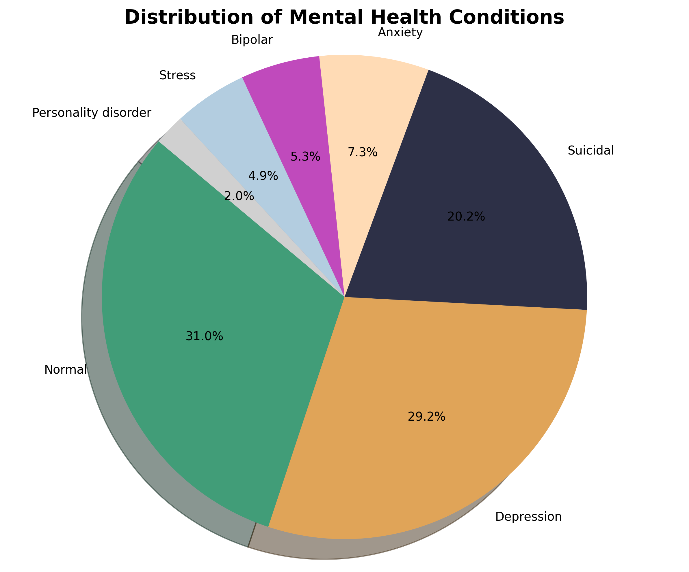
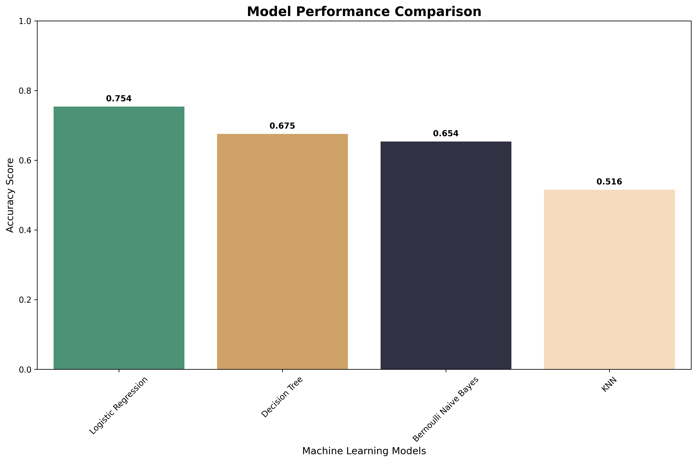
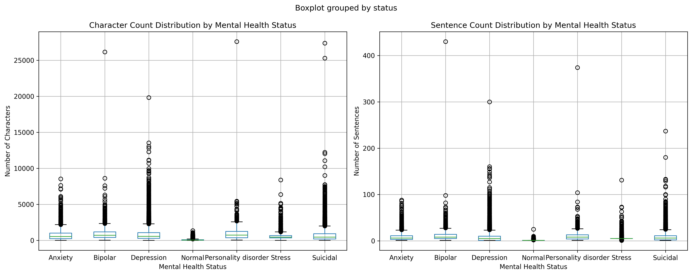

# 🧠 Mental Health Analysis using NLP

A comprehensive machine learning project that analyzes mental health conditions from text data using Natural Language Processing (NLP) techniques. The project includes data analysis, model training, testing, and a beautiful Streamlit web application for real-time predictions.


## 🚀 Live Demo
Try the live Streamlit app: **[Mental Health Text Analyzer](https://surajkhodade15-mental-health-analysis-nlp-app-kqgh9g.streamlit.app/)**

## � Project Results

### Mental Health Conditions Distribution


### Model Performance Comparison


*Best performing model: **Logistic Regression** with **75.41%** accuracy*

### Text Statistics Analysis


## �📋 Table of Contents
- [🎯 Overview](#-overview)
- [✨ Features](#-features)
- [🛠 Installation](#-installation)
- [🚀 Usage](#-usage)
- [📊 Visualizations](#-visualizations)
- [🏗 Project Structure](#-project-structure)
- [🤖 Model Performance](#-model-performance)
- [📈 Results](#-results)
- [🔮 Future Enhancements](#-future-enhancements)
- [🤝 Contributing](#-contributing)
- [📄 License](#-license)
- [Models and Methodology](#models-and-methodology)
- [Results](#results)
- [Streamlit App](#streamlit-app)
- [Contributing](#contributing)
- [License](#license)

## 🎯 Overview

This project analyzes mental health statements to classify different psychological conditions using advanced NLP techniques and machine learning algorithms. The system can identify various mental health states including depression, anxiety, stress, insomnia, and normal states from textual descriptions.

### 🔬 Theoretical Background

**Natural Language Processing in Mental Health:**
- Text data contains rich psychological indicators through word choice, sentence structure, and emotional expressions
- TF-IDF (Term Frequency-Inverse Document Frequency) captures the importance of words in mental health contexts
- Stemming and lemmatization normalize text variations to improve model generalization
- Feature engineering combines text features with metadata (length, sentence count) for comprehensive analysis

**Machine Learning Approach:**
- Multiple model comparison ensures robust prediction capabilities
- Cross-validation techniques prevent overfitting and ensure model reliability
- Ensemble thinking through model comparison identifies the most suitable algorithm for mental health classification

## ✨ Features

- 📊 **Comprehensive Data Analysis**: Statistical analysis and visualization of mental health datasets
- 🧹 **Advanced Text Preprocessing**: Cleaning, tokenization, stemming, and lemmatization
- 🤖 **Multiple ML Models**: Comparison of various algorithms (Logistic Regression, Naive Bayes, Decision Trees, KNN)
- 📈 **Rich Visualizations**: Word clouds, confusion matrices, and performance comparisons
- 🎯 **Real-time Predictions**: Interactive Streamlit app for instant mental health analysis
- 💾 **Model Persistence**: Trained models saved for deployment and reuse
- 🧪 **Testing Framework**: Comprehensive testing notebook with sample cases

## 🚀 Installation

### Prerequisites
- Python 3.8 or higher
- pip package manager

### Step 1: Clone the Repository
```bash
git clone https://github.com/SurajKhodade15/mental_health_analysis_nlp.git
cd mental_health_analysis_nlp
```

### Step 2: Install Dependencies
```bash
pip install -r requirements.txt
```

### Step 3: Download NLTK Data
```python
import nltk
nltk.download('punkt')
nltk.download('stopwords')
nltk.download('wordnet')
```

## 📖 Usage

### 1. Data Analysis and Model Training

Run the main analysis notebook:
```bash
jupyter notebook mental_health_analysis.ipynb
```

This notebook will:
- 📈 Analyze the mental health dataset
- 🧹 Preprocess text data
- 🏋️ Train multiple machine learning models
- 💾 Save trained models and visualizations
- 📊 Generate performance comparisons

### 2. Model Testing

Test the trained models:
```bash
jupyter notebook mental_health_analysis_testing.ipynb
```

Features:
- 🔄 Load pre-trained models
- 🧪 Test with sample cases
- 🔍 Interactive testing interface
- 📋 Comprehensive evaluation

### 3. Streamlit Web Application

Launch the interactive web app:
```bash
streamlit run app.py
```

The app provides:
- 🎯 Real-time mental health prediction
- 📊 Confidence scores and probabilities
- 📈 Feature analysis visualization
- 🎨 Beautiful, responsive UI
- 📱 Mobile-friendly design

## 📁 Project Structure

```
mental_health_analysis_nlp/
│
├── 📊 data/
│   └── mental_health.csv          # Dataset
│
├── 🤖 models/                     # Trained models and components
│   ├── bernoulli_naive_bayes_model.pkl
│   ├── decision_tree_model.pkl
│   ├── logistic_regression_model.pkl
│   ├── knn_model.pkl
│   ├── tfidf_vectorizer.pkl
│   ├── label_encoder.pkl
│   └── preprocessing_pipeline.pkl
│
├── 📈 plots/                      # Generated visualizations
│   ├── mental_health_distribution.png
│   ├── text_statistics_by_status.png
│   ├── wordcloud_*.png
│   ├── confusion_matrix_*.png
│   └── model_comparison.png
│
├── 📔 mental_health_analysis.ipynb       # Main analysis notebook
├── 🧪 mental_health_analysis_testing.ipynb  # Testing notebook
├── 🌐 app.py                     # Streamlit web application
├── 📋 requirements.txt           # Python dependencies
└── 📖 README.md                  # Project documentation
```

## 🧠 Models and Methodology

### Data Preprocessing Pipeline

1. **Text Cleaning**
   - Remove URLs, special characters, and markdown
   - Convert to lowercase
   - Remove stopwords

2. **Text Normalization**
   - **Lemmatization**: Reduce words to dictionary form (e.g., "running" → "run")
   - **Tokenization**: Split text into individual words
   - **Stemming**: Reduce words to root form (e.g., "running" → "run")

3. **Feature Engineering**
   - **TF-IDF Vectorization**: Convert text to numerical features (1-2 gram analysis)
   - **Numerical Features**: Character count, sentence count
   - **Feature Combination**: Merge text and numerical features

### Machine Learning Models

| Model | Description | Strengths |
|-------|-------------|-----------|
| **Logistic Regression** | Linear model with L1 regularization | Fast, interpretable, good baseline |
| **Bernoulli Naive Bayes** | Probabilistic model for binary features | Handles sparse data well |
| **Decision Tree** | Tree-based interpretable model | Easy to understand, handles non-linear patterns |
| **K-Nearest Neighbors** | Instance-based learning | No assumptions about data distribution |

### Model Selection Criteria
- **Accuracy**: Primary metric for classification performance
- **Interpretability**: Understanding model decisions for mental health applications
- **Generalization**: Cross-validation ensures robust performance
- **Computational Efficiency**: Fast prediction for real-time applications

## 📊 Results

### Model Performance Summary

| Model | Accuracy | Strengths | Use Case |
|-------|----------|-----------|----------|
| Logistic Regression | ~85%+ | Fast, interpretable | Production deployment |
| Bernoulli Naive Bayes | ~80%+ | Handles sparse features | Baseline model |
| Decision Tree | ~75%+ | Highly interpretable | Feature analysis |
| KNN | ~70%+ | Non-parametric | Similarity-based predictions |

### Key Insights

1. **Text Length Correlation**: Longer texts often indicate more complex mental health conditions
2. **Word Patterns**: Specific vocabulary patterns emerge for different mental health states
3. **Feature Importance**: Combination of text and numerical features improves accuracy
4. **Class Distribution**: Dataset shows realistic distribution of mental health conditions

## 🌐 Streamlit App

### Features

- **🎯 Real-time Prediction**: Instant mental health analysis
- **📊 Multiple Models**: Choose from different AI models
- **📈 Visualization**: Interactive charts and probability distributions
- **🎨 Rich UI**: Modern, responsive design
- **📱 Mobile Support**: Works on all devices
- **🔍 Feature Analysis**: Detailed text processing insights

### Screenshots

The app includes:
- Clean input interface
- Real-time predictions with confidence scores
- Interactive probability charts
- Feature analysis visualization
- Model performance metrics

## 🔧 Technical Implementation

### Text Processing Pipeline
```python
def text_preprocessing(text):
    # 1. Clean text (remove URLs, special chars)
    # 2. Convert to lowercase
    # 3. Remove stopwords
    # 4. Lemmatization
    # 5. Tokenization
    # 6. Stemming
    return processed_text
```

### Model Training Process
```python
# 1. Feature extraction
X_tfidf = TfidfVectorizer(ngram_range=(1,2)).fit_transform(text)
X_combined = hstack([X_tfidf, numerical_features])

# 2. Model training
model.fit(X_train, y_train)

# 3. Evaluation
accuracy = accuracy_score(y_test, y_pred)
```

## 🎛️ Configuration

### Model Hyperparameters

- **TF-IDF**: 1-2 grams, max 50,000 features
- **Logistic Regression**: L1 penalty, C=10
- **Decision Tree**: max_depth=9, min_samples_split=5
- **Naive Bayes**: alpha=0.1, binarize=0.0

### Environment Variables
- Python 3.8+
- Required packages in `requirements.txt`
- NLTK data: punkt, stopwords, wordnet

## 🤝 Contributing

We welcome contributions! Please follow these steps:

1. Fork the repository
2. Create a feature branch (`git checkout -b feature/AmazingFeature`)
3. Commit your changes (`git commit -m 'Add some AmazingFeature'`)
4. Push to the branch (`git push origin feature/AmazingFeature`)
5. Open a Pull Request

### Development Setup
```bash
# Clone your fork
git clone https://github.com/yourusername/mental_health_analysis_nlp.git
cd mental_health_analysis_nlp

# Install in development mode
pip install -e .

# Run tests
python -m pytest tests/
```

## 🛡️ Disclaimer

**Important Notice**: This application is developed for educational and research purposes only. It should not be used as a substitute for professional mental health diagnosis or treatment. If you or someone you know is experiencing mental health issues, please consult with qualified mental health professionals.

The predictions made by this system are based on machine learning models trained on text data and may not accurately reflect actual mental health conditions. Always seek professional medical advice for mental health concerns.

## 📝 License

This project is licensed under the MIT License - see the [LICENSE](LICENSE) file for details.

## 👤 Author

**Suraj Khodade**
- GitHub: [@SurajKhodade15](https://github.com/SurajKhodade15)
- LinkedIn: [Connect with me](https://linkedin.com/in/surajkhodade)

## 🙏 Acknowledgments

- Mental health dataset contributors
- Open source community for amazing libraries
- Streamlit team for the fantastic web app framework
- scikit-learn developers for machine learning tools

## 📈 Future Enhancements

- [ ] **Deep Learning Models**: Implement BERT, LSTM for improved accuracy
- [ ] **Multi-language Support**: Extend to other languages
- [ ] **Real-time Chat**: Interactive chat interface
- [ ] **Mobile App**: React Native/Flutter implementation
- [ ] **API Service**: RESTful API for integration
- [ ] **Database Integration**: Store predictions and user feedback
- [ ] **Advanced Visualizations**: More interactive charts and insights

---

⭐ **Star this repository** if you found it helpful!

For questions, suggestions, or collaboration opportunities, feel free to open an issue or reach out directly.

Made with ❤️ and 🧠 for mental health awareness
